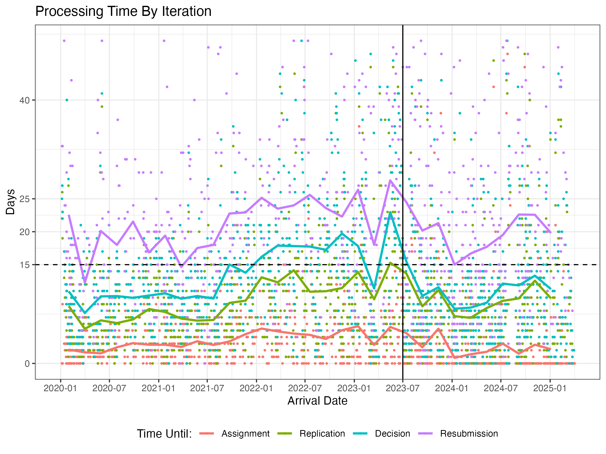
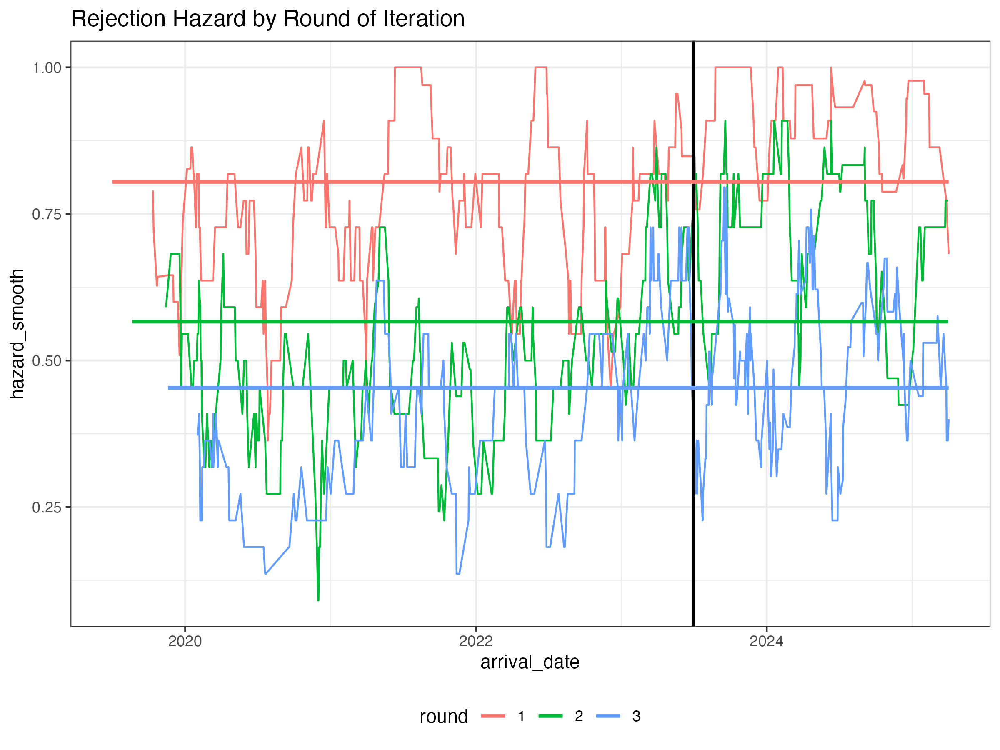
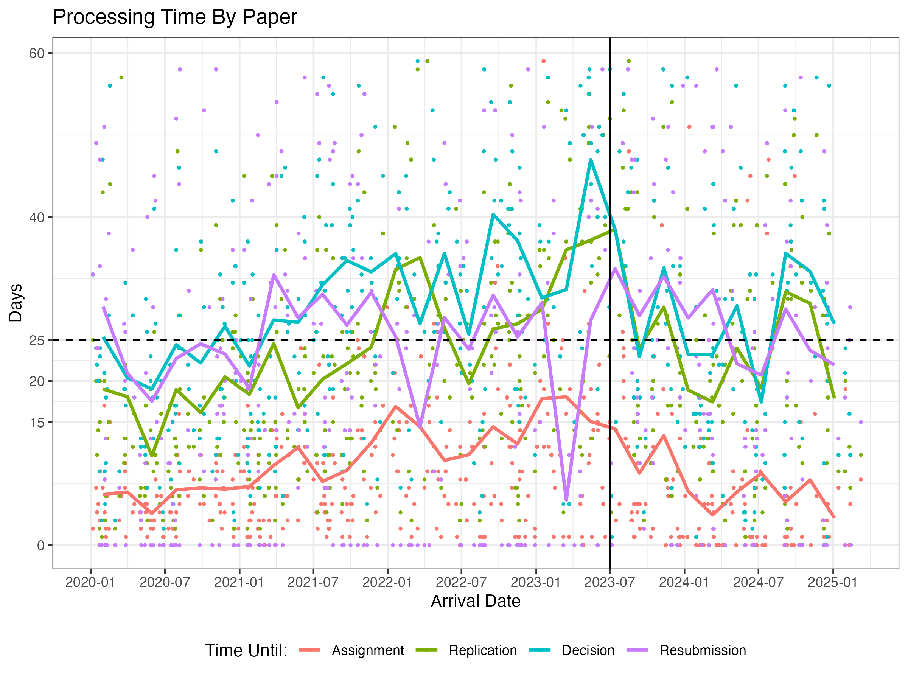
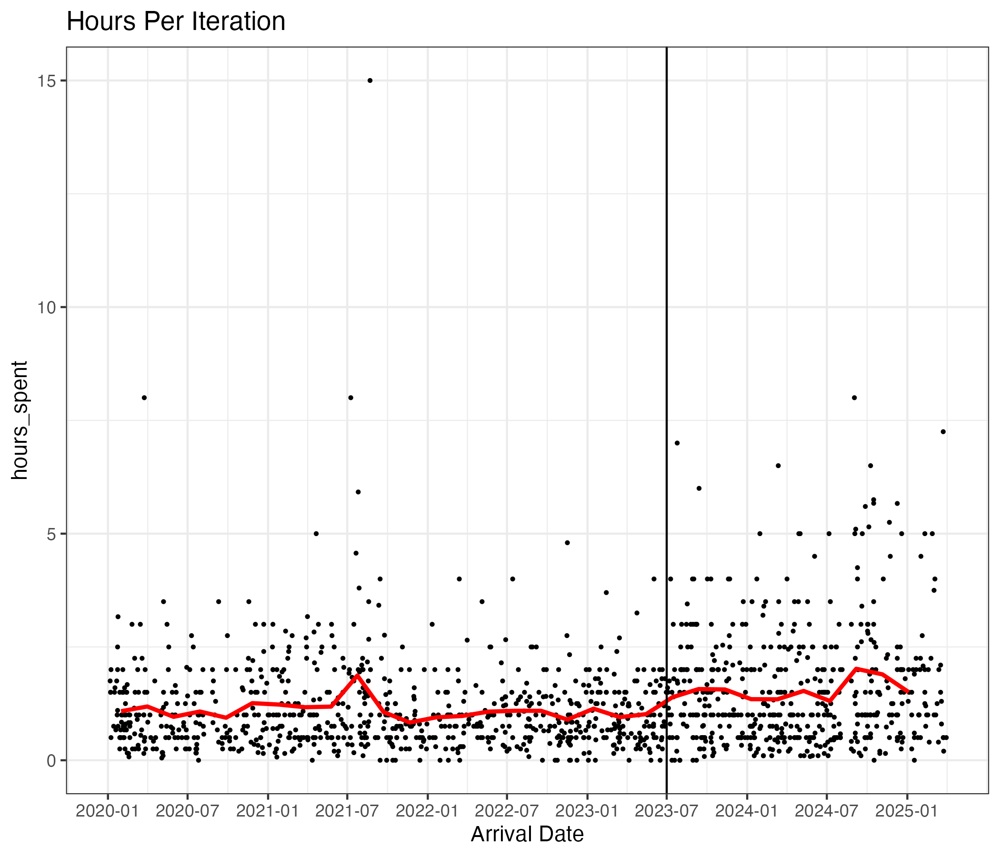
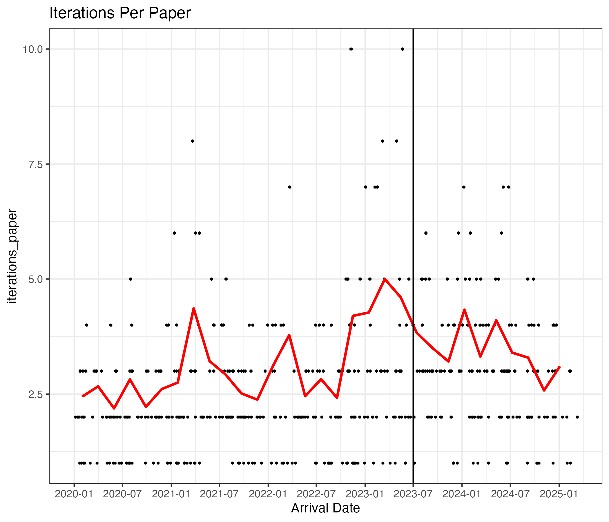
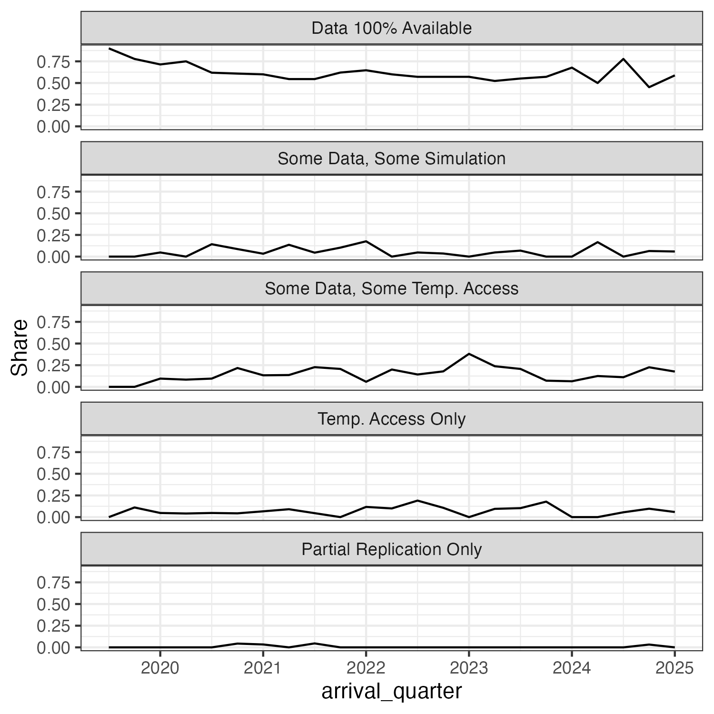

## Agenda

1.  Successful Search for Successor
2.  Outreach and Training Events
2.  Performance Report

## New Data Editor

* Starting July 1st Damian Clarke will take over as RES Data Editor. I am leaving to implement the Data Editor role at the JPE.
* Fabien Postel-Vinay, Brooke Sperry, Jaap Abbring, Francesco Lippi and myself were on the search committee.
* I'm planning to start hand over asap.

## Outreach and Training Events

* Pre-conference reproducibility workshop at Irish Economic Association at Belfast U
* Reproducibility workshop at Collegio Carlo Alberto + local Unis

# EJ Data Editor Report {background-color="#40666e"}

::: footer
:::

## Processing Times

```{r}
#| message: false
#| warning: false
library(RESr)
x = read_ej()
cl = RESr:::clean_list(x)
```

::: {.column width="74%"}

:::

::: {.column width="25%"}
<br>

-   Stayed below 15 day mark.
-   Trying to get resubmission times down.
-   Graph shows cumulative times.
:::

------------------------------------------------------------------------

## Revisions Per Paper

::: {.column width="65%"}

:::

::: {.column width="30%"}
<br>

-   80% of papers fail in first round.
-   Hazard still 50% in second round.
-   Difficult packages
:::

```{=html}
<!-- ---

## Processing Times Per Paper

::: {.column width="65%"}

:::

::: {.column width="30%"}
<br>

* Replication times per paper falling.
* Resubmission times increasing.
* Graph shows cumulative times.
::: -->
```

---

## Difficult Packages


👉 Waiting for author replies:

```julia
 Row │ days_waiting  case_id                  round    editor  
─────┼─────────────────────────────────────────────────────────
   1 │ 0 days        Katovich-20230276-R5     5        EK
   2 │ 4 days        Rotunno-20210861-R3      3        MM
   3 │ 4 days        Milner-20221030-R7       7        EK
   4 │ 4 days        Archsmith-20230968-R3    3        SH
   5 │ 8 days        Ramey-20231019-R3        3        FP
   6 │ 9 days        Oosterlinck-20240695-R3  3        SB
   7 │ 9 days        Agranov-20230526-R3      3        SH
   8 │ 37 days       Barrage-20191485-R2      2        EC
   9 │ 47 days       Lucas-20230707-R2        2        SA
  10 │ 70 days       Bargain-20201684-R6      6        EZ
  11 │ 147 days      Nix-20231116-R2          2        BP
  12 │ missing       Li-20230290-R1           1        HBI
  13 │ missing       Gonzalez-20220342-R1     1        SA
  14 │ missing       Davis-20231015-R1        1        SA
  15 │ missing       Cornelson-20240847-R1    1        SB
  16 │ missing       Adhvaryu-20230588-R1     1        SA
  17 │ missing       Markiewicz-20230331-R1   1        FP
  18 │ missing       Schmick-20240045-R1      1        SB
  ```

## Hours Spent per Iteration

-   As before we pay replicators by the hour.
-   on average 1h per iteration, 2 iterations per paper 👉 2h per paper.

::: {.column width="45%"}

:::

::: {.column width="45%"}

:::


## Detailed Operations

Breakdown of hours worked and cost for EJ:


```{r}


kableExtra::kable(RESr:::billing_table_ej()[Quarter > "2023 Q4" & Quarter < "2025 Q2",1:5],digits = 1)
```

------------------------------------------------------------------------

## Software

::: {style="font-size: 80%;"}
```{r}
kableExtra::kable(RESr:::list_software(cl)$table)
```
:::


------------------------------------------------------------------------

## Data Availability

::: {.column width="65%"}

:::

::: {.column width="30%"}
-   Confidential (👉 for us: *complicated*) Data is on the rise.
-   Temporary Access is a good solution for us.
-   Partial and temp. only are the exception.
-   We changed policy slightly to encourage temp access.
:::

:::

# End

It was a pleasure to collaborate and learn from you. Hope to see you around. Thank you!
